<picture>
  <source media="(prefers-color-scheme: dark)" srcset="./dark.svg">
  <source media="(prefers-color-scheme: light)" srcset="./light.svg">
  
</picture>

 

## About Me

I'm a Data Analyst and technology enthusiast who enjoys turning raw, messy data into clear, actionable insight. My day-to-day toolkit is Python, SQL, Excel and data visualization — and I care most about uncovering patterns that actually drive a decision, not just building another dashboard.

Currently pursuing my B.Tech in Computer Science at **Jagannath University**, Jaipur, while building hands-on analytics and AI/ML projects alongside coursework.

- 🔭 Currently sharpening my skills in **Data Analytics, EDA & Machine Learning**
- 🌱 Learning: **RAG-based AI systems, Scikit-learn, TensorFlow**
- 📍 Based in **Jaipur, Rajasthan, India**
- 📫 Reach me at **sashiverma7779@gmail.com**

 

## 🎓 Education

**Jagannath University**, Jaipur, India
*B.Tech in Computer Science* — Jul 2023 – Expected Jul 2027
Coursework: Data Structures & Algorithms, Operating Systems, DBMS, Computer Networks, OOP, AI, ML

 

## 💼 Experience

**AI & Data Science Intern — Knowx Innovations Pvt. Ltd.**
*Jul 2026 – Aug 2026* · [Certificate](https://drive.google.com/file/d/1IULMwwjTOGHRZqgoxVCJ_9Q-hg1JjBxM/view)

`Python` `Pandas` `NumPy` `Scikit-learn` `TensorFlow` `Matplotlib` `RAG`

- Analyzed and prepared data using Python, Pandas, and NumPy to support AI/ML solutions and data-driven insights
- Developed a real-time Crop Advisory solution, applying Machine Learning and RAG techniques to generate practical recommendations

 

## 🚀 Featured Projects

### [Ecommerce Sales Analysis](https://github.com/sashibitcode/Ecommerce-Sales-Analysis)
`Python` `Jupyter Notebook` `Power BI`
Analyzed Superstore e-commerce data to uncover sales trends, regional performance, category insights, and profit patterns — built visualizations and dashboards highlighting **$2.29M sales, $286K profit, and a 12.47% profit margin**.

### [IPL Cricket Analysis](https://github.com/sashibitcode/IPL-Cricket-Analysis)
`Python` `SQL` `Power BI` `Pandas` `Data Visualization`
Analyzed IPL match and delivery data using Python, EDA, and SQL to uncover team, player, and performance trends; prepared cleaned datasets, KPI summaries, and visual insights for an interactive Power BI dashboard.

### [Covid-19 Analysis](https://github.com/sashibitcode/covid-19-analysis)
`Python` `SQL` `Power BI` `Pandas` `Data Visualization`
Analyzed global COVID-19 data to uncover country, regional, and time-based trends in cases, recoveries, deaths, and active cases through an end-to-end analytics workflow — data cleaning, validation, EDA, SQL reporting, and Power BI dashboards.

 

## 🛠️ Engineering & Analytics Stack

**Languages:**  

**Data Analytics:** Data Cleaning · Data Preprocessing · Exploratory Data Analysis (EDA) · Statistical Analysis · Data Visualization · Data Interpretation

**Python Libraries:**    

**Databases:**  

**Statistics & Analysis:** Descriptive Statistics · Correlation Analysis · Hypothesis Testing · Trend Analysis

**Tools:**     

 

## 📜 Certifications

- **PCAP: Programming Essentials in Python** — Cisco Networking Academy & OpenEDG Python Institute, Jul 2024 · [Certificate](https://drive.google.com/file/d/1kZddy3YxtR_5xhyI9eO3qiV8f9T3Sk5N/view)
- **Data Visualisation: Empowering Business with Effective Insights** — Forage, Jul 2025 · [Certificate](https://drive.google.com/file/d/1Dm0Vs2yuJGtHb-YrgBEfFAWIyfg24Iff/view)
- **Introduction to Generative AI Studio** — Jul 2025 · [Certificate](https://drive.google.com/file/d/1sLa47xdf01y6WnzvV9p3yEL_owlbNsdv/view)

 

## 📊 GitHub Activity

<picture>
  <source media="(prefers-color-scheme: dark)" srcset="https://github-readme-stats.vercel.app/api?username=sashibitcode&show_icons=true&theme=dark&hide_border=true&bg_color=0B1220">
  <source media="(prefers-color-scheme: light)" srcset="https://github-readme-stats.vercel.app/api?username=sashibitcode&show_icons=true&theme=default&hide_border=true">
  
</picture>
<picture>
  <source media="(prefers-color-scheme: dark)" srcset="https://github-readme-streak-stats.herokuapp.com/?user=sashibitcode&theme=dark&hide_border=true&background=0B1220">
  <source media="(prefers-color-scheme: light)" srcset="https://github-readme-streak-stats.herokuapp.com/?user=sashibitcode&hide_border=true">
  
</picture>

 

## 📫 Connect With Me

Thanks for stopping by — always open to connect on data, analytics, or AI projects.

